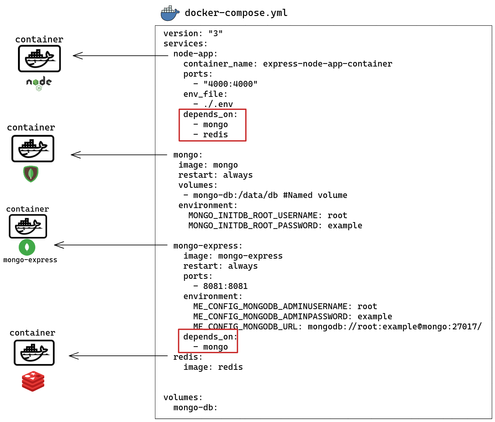
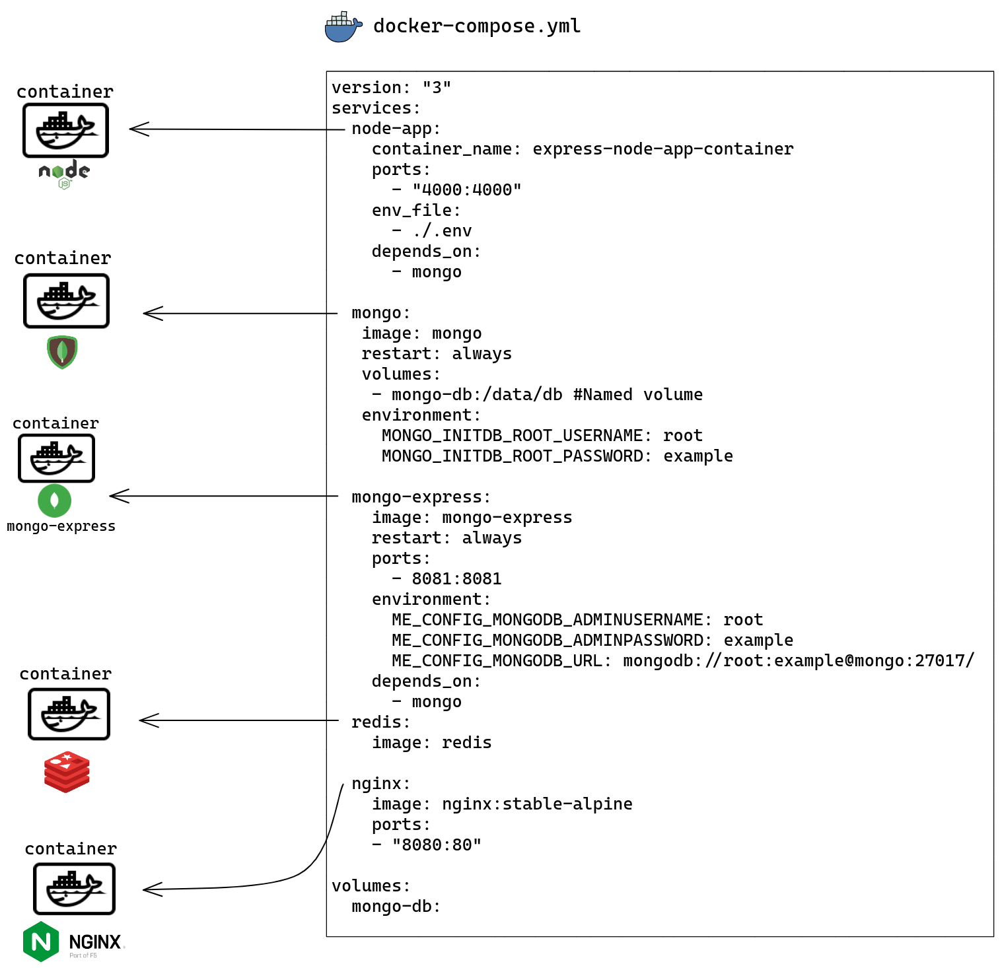

# Docker Practical Course - [Tresmerge](https://www.youtube.com/watch?v=tHP5IWfqPKk&list=PLzNfs-3kBUJnY7Cy1XovLaAkgfjim05RR&index=1)


### Table of content

1. [Docker desktop.](#desc0)
2. [Basic Dockerfile.](#desc1)
3. [Basic Command Lines.](#desc2)
4. [The difference between images and containers.](#desc3)
5. [Docker Optimization.](#desc4)
6. [Volumes.](#desc5)
7. [Hot Reload.](#desc6)
8. [Docker Compose.](#desc7)
9. [Environment Variables.](#desc8)
10. [Docker Environments Management.](#desc9)
11. [Multi-Stage Dockerfile.](#desc10)
12. [Docker with different services](#desc11)
    - MongoDB.
    - NodeJS.
    - Mongo-Express.
    - Redis.
    - Nginx.

<a name="desc0"></a>
## Docker desktop

- First of all, you have to install [Docker desktop](https://docs.docker.com/) on your machine.


<a name="desc1"></a>
## Basic Dockerfile
```
FROM node:14

WORKDIR /app

COPY package.json .

RUN npm install 

COPY . .

EXPOSE 4000

CMD [ "npm", "start" ]

```

#### 1. ```FROM node:14```
Inside the container, install node js.

#### 2. ```WORKDIR /app```
Create Folder "app".

#### 3. ```COPY package.json .```
copy package.json inside "app" Folder.

#### 4. ```RUN npm install ```
RUN nmp install to install all the packages inside package.json -> node_modules.

#### 5. ```COPY . . ```
Copy all files inside the container.

#### 6. ```EXPOSE 4000 ```
The app will run on port 4000, just for documentation.

#### 7. ```CMD [ "npm", "start" ] ```
Run the App using npm.

#### 8. ```CMD [ "npm", "run", "start-dev" ] ```
Run the App using nodemon, To make the server detect all the changes.

- Check out the figure for more explanation.


<a name="desc2"></a>
## Basic Command Lines

#### 1. ``` docker build -t "name of the Dockerfile" ```
- example:- ```docker build -t express-node-app .```
- After build the Dockerfile (you have an "image" now).
- Dockerfile → bulid → image → Run → Container.

#### 2. ``` docker run --name "name of the container" "name of image" ```
- example:- ```docker run --name express-node-app-container express-node-app```, 1st way.
- example:- ```docker run --name express-node-app-container -d express-node-app```, 2nd way, What is new here is the flag ```-d``` for detach the logs.

#### 3. ``` docker run --name "name of the container" "name of image" ```
- example:- ```docker run --name express-node-app-container express-node-app```, 1st way.
- example:- ```docker run --name express-node-app-container -d express-node-app```, 2nd way, What is new here is the flag ```-d``` for detach the logs.
- Now, if you run the app on your localhost, it doesn't work. You have to ***forward the port*** first. How?! , See the following command line.


#### 4. ```docker run --name "name of the container" -d -p my local machine port:container port "name of image"  ```
- example:- ```docker run --name express-node-app-container -d -p 4000:4000 express-node-app```

#### 5. ```docker image ls```
- list all images.

#### 6. ```docker image ls```
- list all the running containers.

#### 7. ```docker rm "the name of container" -f```
- example:- ```docker rm express-node-app-container -f```.

#### 8. ```docker exec -it "name of the container" bash```
- example:- ```docker exec -it express-node-app-container bash```.
- Open an interactive terminal in the container.
- Your terminal now:
``` 
root@dee98138027a:/app# ls
Dockerfile  index.js  node_modules  package-lock.json  package.json
root@dee98138027a:/app#
```
#### 9. ```docker logs "the name of container"```
- example:- ```docker logs  express-node-app-container```.
- To see the logs of the container.

#### 10. ```docker --help```
- For all command-line details.

<a name="desc3"></a>
## The difference between images and containers

- Check out the figure.


<a name="desc4"></a>
## Docker Optimization
- Create ```.dockerignore``` to avoid useless files.
- Why was the package.json file copied first and then all the other files copied again?
- Good question; check the figure for the answer.


<a name="desc5"></a>
## Volumes
- When do we need Docker Volumes?
- What exactly is Docker Volumes?
- Docker Volumes Types.
- Check out the figure.


<a name="desc6"></a>
## Hot Reload
- syncing between the local environment and the container.
- When you run the container, use that ```run --name "name of the container"``` ```-v``` ***absolute path for your local directory***:***Whatever directory is inside the container you want to sync with*** ```-d -p my local machine port:container port "name of image"```.
- example:- ```docker run --name express-node-app-container -v /home/mohamed/Desktop/Safrot/Projects/Docker/node-app:/app -d -p 4000:4000 express-node-app```.
- Also, you can use this instead of the full path:
    - Linux and mac: ```$(pwd)```, The command line will be as follows: ```docker run --name express-node-app-container -v $(pwd):/app -d -p 4000:4000 express-node-app```.
    - Windows: ```%cd%```, The command line will be as follows: ```docker run --name express-node-app-container -v %cd%:/app -d -p 4000:4000 express-node-app```.
- But what are the problems here?
    - If you add or delete files inside the container or on the local machine, this will change both sides at the same time.
    - One suggested solution is to sync or bind the application source code on your localhost with the application source code in the container,      considering that you make the directory in the container read-only.
    - example: 
        - ```docker run --name express-node-app-container -v $(pwd)/src:/app/src:ro -d -p 4000:4000 express-node-app```
 

<a name="desc7"></a>
## Docker Compose
- What is Docker Compose?
    - Docker Compose is a tool for defining and running multi-container Docker applications.by using a ```YAML file``` to configure your application services. 
    Then, with a single command, you create and start all the services in your configuration.
    
- ```docker-compose.yml:```
 ``` 
 version: "3"
services:
  node-app: 
    container_name: express-node-app-container
    build: .
    volumes:
      - ./src:/app/src:ro
    ports: 
      - "4000:4000"
```  
- Check out the figure.


<a name="desc8"></a>
## Environment Variables.

- How to pass environment variables to the container?
    1. Via the Dockerfile itself, as follows:
        - You'll notice here that we used ```ENV PORT=4000``` inside the Docker file itself.
    ```
    FROM node:14

    WORKDIR /app

    COPY package.json .

    RUN npm install 

    COPY . .
    
    ENV PORT=4000

    EXPOSE $PORT

    CMD [ "npm", "run", "start-dev" ]

    ```
    2. Via the command line, as follows:
    ```
    --env list                       Set environment variables
    --env-file list                  Read in a file of environment variables
    ```
     - eg:
    ```
    - Set environment variables:
    docker run --name express-node-app-container -v $(pwd)/src:/app/src:ro --env PORT=400 --env NODE_ENV=development -d -p 4000:4000 express-node-app
    - Read in a file of environment variables:
    ocker run --name express-node-app-container -v $(pwd)/src:/app/src:ro --env-file ./.env -d -p 4000:4000 express-node-app
    ```
    - So, if you open an interactive terminal in the container and use printenv, you will find your env variables.
    ```
    $ docker exec -it express-node-app-container bash
    root@78ca00db2d62:/app# printenv
    PORT=400
    NODE_ENV=development
    ```
    3. Via the docker-compose, as follows:
      
     - Set environment variables.
    ```
    version: "3"
    services:
        node-app: 
         container_name: express-node-app-container
         build: .
         volumes:
          - ./src:/app/src:ro
         ports: 
          - "4000:4000"
         environment:
          - Port=4000
          - NODE_ENV=production
    ```
    - Read in a file of environment variables.
    
    
   ```
    version: "3"
    services:
        node-app: 
         container_name: express-node-app-container
         build: .
         volumes:
          - ./src:/app/src:ro
         ports: 
          - "4000:4000"
         env_file:
          - ./.env
    ```

<a name="desc9"></a>
## Docker Environments Management

- Docker environment management across multiple environments.
- The first method and the optimization.
- Check out the figure.


- the command lines in the figure, to be copied if you want
   - ```Run: docker-compose -f docker-compose.dev.yml up -d```
   - ```Run: docker-compose -f docker-compose.prod.yml up -d```
   - ```Development Run: sudo docker-compose -f docker-compose.yml  -f docker-compose.dev.yml  up -d```
   - ```Production Run: sudo docker-compose -f docker-compose.yml  -f docker-compose.prod.yml  up -d```
   - ```docker exec -it express-node-app-container bash```

<a name="desc10"></a>
## Multi-Stage Dockerfile

- The first solution is that you can create a Dockerfile for each environment.
- The second solution is that you can create a single Docker file and manage all environments through it.
- in the last part we faced tow proplems 
     -  We have to run ```CMD [ "npm", "start" ]``` in production and ```CMD [ "npm", "run", "start-dev" ]``` in development.
    <br>
    
    ``` 
    development:
     version: "3"
     services:
      node-app:
       volumes:
         - ./src:/app/src:ro
       environment:
         - NODE_ENV=development
       command: npm run start-dev
     ``` 
     ``` 
    production:
     version: "3"
     services:
      node-app:
       environment:
         - NODE_ENV=production
       command: npm run start
     ``` 
     - Nodemon is installed in node modules, although we are running the container from the production compose file and not from the development compose file.
     
       - Make a simple check to verify the environment.<br>
 
            <br>
          
            - the command lines in the figure, to be copied if you want.<br>
                 -  simple check <br>
                ```
                RUN if ["$NODE_ENV" = 'production'];\
                then nmp install --only=production;\
                else npm install;\
                fi
                ```
                - ```sudo docker-compose -f docker-compose.yml  -f docker-compose.dev.yml  up -d --build```

                - ```sudo docker-compose -f docker-compose.yml  -f docker-compose.prod.yml  up -d --build```
          
       
       - The Multi-Stage environment.<br>
         - The Multi-Stage environment is when you separate the Dockerfile for more than one stage.
         - Check out the figure.
         
                <br>
          
          - the command lines in the figure, to be copied if you want.<br>
            -  Docker File with multistage<br>
              
                ```
                FROM node:14 as base

                FROM base as development

                WORKDIR /app
                COPY package.json .
                RUN npm install 
                COPY . .
                EXPOSE 4000
                CMD [ "npm", "run", "start-dev" ]

                FROM base as production

                WORKDIR /app
                COPY package.json .
                RUN npm install --only=production 
                COPY . .
                EXPOSE 4000
                CMD [ "npm", "start"]
                ```
                
                - ```sudo docker-compose -f docker-compose.yml  -f docker-compose.dev.yml  up -d --build```

                - ```sudo docker-compose -f docker-compose.yml  -f docker-compose.prod.yml  up -d --build```

<a name="desc11"></a>
## Docker with different services


- You can find the code in the ```Services``` folder.
- [MongoDB](https://www.mongodb.com/) & [NodeJS](https://nodejs.org/en/) & [Mongo-Express](https://github.com/mongo-express/mongo-express).
- Check out the figure.

    <br><br>
    <br><br>
    <br><br>
    <br><br>
    
- Some command lines you have to know here are:
   - ```sudo docker inspect "name of the container"```, Return low-level information on Docker objects.
   - ```sudo docker volume ls```, List volumes.
   - ```sudo docker volume prune```, Remove all unused local volumes.
   - And always remember that if you use ```--help``` after any utility, you will get more information about all command lines.
   
     - eg. ```docker volume --help```
     <br>
     
     ```
     Usage:  docker volume COMMAND

     Manage volumes

     Commands:
     create      Create a volume
     inspect     Display detailed information on one or more volumes
     ls          List volumes
     prune       Remove all unused local volumes
     rm          Remove one or more volumes
     
     Run 'docker volume COMMAND --help' for more information on a command.
     
     ```
- [Redis](https://redis.io/).
    - As we have learned, go to the Docker Hub and search for Redis; you will find the official version. You can find how to add the service in the documentation.
    - Now add the new container to ```docker-compose.yml```.As we did in the last part. 
    
    <br>
    
    <br>
    
    - Now let's run the app, ```sudo docker-compose -f docker-compose.yml  -f docker-compose.dev.yml  up -d```, You can see:
       
       ```
       Status: Downloaded newer image for redis:latest
       Creating services_mongo-express_1   ... done
       Creating express-node-app-container ... done
       Creating services_mongo_1           ... done
       Creating services_redis_1           ... done 
       ```
     - Important thing to remember, When you start running containers, it will start randomly, so if one container depends on another, you have to specify this.As follows:

    <br>
    
    <br>
    <br>
    
- [Nginx](https://www.nginx.com/)
    - As we have learned, go to the Docker Hub and search for Nginx; you will find the official version. You can find how to add the service in the documentation.
    - Now add the new container to ```docker-compose.yml```.As we are used to.
    
    <br>
    
    <br>
    
    - Now let's run the app, ```sudo docker-compose -f docker-compose.yml  -f docker-compose.dev.yml  up -d```, You can see:
       
       ```
        Status: Downloaded newer image for nginx:stable-alpine
        Creating services_redis_1 ... done
        Creating services_mongo_1 ... done
        Creating services_nginx_1 ... done
        Creating express-node-app-container ... done
        Creating services_mongo-express_1   ... done
       ```
       
    - Now let's make the nginx server receive the requests and forward them to my node-app.   
     
