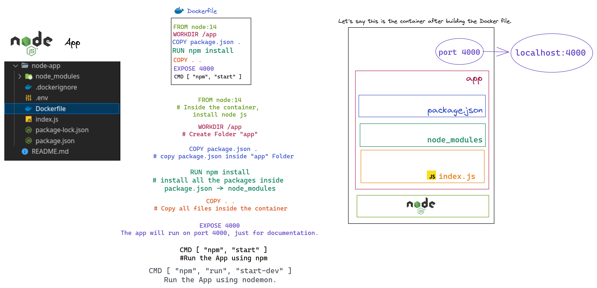

# Docker Practical Course - [Tresmerge](https://www.youtube.com/watch?v=tHP5IWfqPKk&list=PLzNfs-3kBUJnY7Cy1XovLaAkgfjim05RR&index=1)

- First of all, you have to install [Docker desktop](https://docs.docker.com/) on your machine.

## Basic Dockerfile 
```
FROM node:14

WORKDIR /app

COPY package.json .

RUN npm install 

COPY . .

EXPOSE 4000

CMD [ "npm", "start" ]

```

#### 1. ```FROM node:14```
Inside the container, install node js.

#### 2. ```WORKDIR /app```
Create Folder "app".

#### 3. ```COPY package.json .```
copy package.json inside "app" Folder.

#### 4. ```RUN npm install ```
RUN nmp install to install all the packages inside package.json -> node_modules.

#### 5. ```COPY . . ```
Copy all files inside the container.

#### 6. ```EXPOSE 4000 ```
The app will run on port 4000, just for documentation.

#### 7. ```CMD [ "npm", "start" ] ```
Run the App using npm.

#### 8. ```CMD [ "npm", "run", "start-dev" ] ```
Run the App using nodemon.

- Check out the figure for more explanation.



## Basic Command Lines

#### 1. ``` docker build -t "name of the Dockerfile" ```
- example:- ```docker build -t express-node-app .```
- After build the Dockerfile (you have an "image" now).
- Dockerfile → bulid → image → Run → Container.

#### 2. ``` docker run --name "name of the container" "name of image" ```
- example:- ```docker run --name express-node-app-container express-node-app```, 1st way.
- example:- ```docker run --name express-node-app-container -d express-node-app```, 2nd way, What is new here is the flag ```-d``` for detach the logs.

#### 3. ``` docker run --name "name of the container" "name of image" ```
- example:- ```docker run --name express-node-app-container express-node-app```, 1st way.
- example:- ```docker run --name express-node-app-container -d express-node-app```, 2nd way, What is new here is the flag ```-d``` for detach the logs.
- Now, if you run the app on your localhost, it doesn't work. You have to ***forward the port*** first. How?! , See the following command line.


#### 4. ```sudo run --name "name of the container" -d -p my local machine port:container port "name of image"  ```
- example:- ```docker run --name express-node-app-container -d -p 4000:4000 express-node-app```

#### 5. ```docker image ls```
- list all images.

#### 6. ```docker image ls```
- list all the running containers.

#### 7. ```docker rm "the name of container" -f```
- example:- ```sudo docker rm express-node-app-container -f```.

#### 8. ```docker exec -it "name of the container" bash```
- example:- ```sudo docker exec -it express-node-app-container bash```.
- Open an interactive terminal in the container.
- Your terminal now:
``` 
root@dee98138027a:/app# ls
Dockerfile  index.js  node_modules  package-lock.json  package.json
root@dee98138027a:/app#
```
#### 9. ```docker logs "the name of container"```
- example:- ```docker logs  express-node-app-container```.
- To see the logs of the container.

## Docker Optimization
- Create ```.dockerignore``` to avoid useless files.
- To make the server detect all the changes will use ```CMD [ "npm", "run", "start-dev" ]```(Run the App using nodemon).

## Hot Reload
- syncing between the local environment and the container.
- When you run the container, use that ```sudo run --name "name of the container" -v local dir:contaoner dir -d -p my local machine port:container port "name of image"```.
- example:- ```sudo docker run --name express-node-app-container -v /home/mohamed/Desktop/Safrot/Projects/Docker/node-app:/app -d -p 4000:4000 express-node-app```.
- But what are the problems here?
   -
